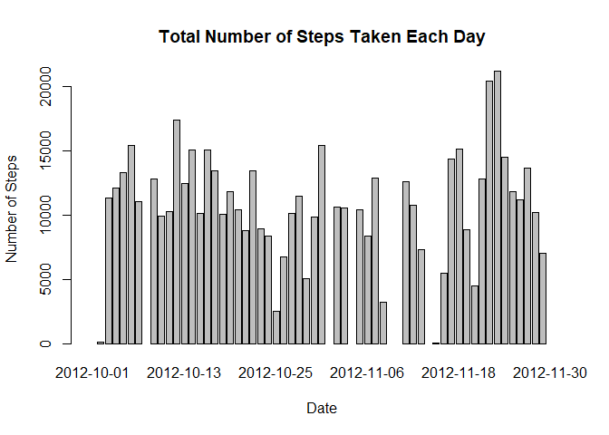
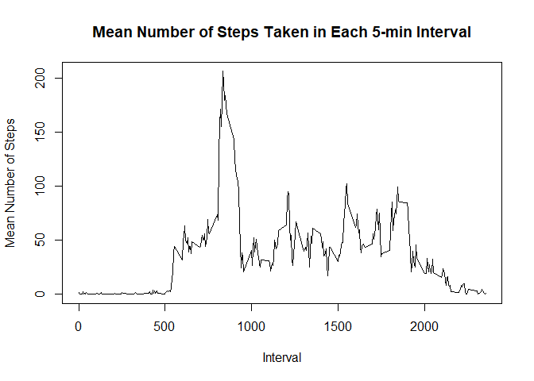
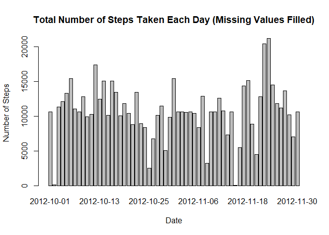
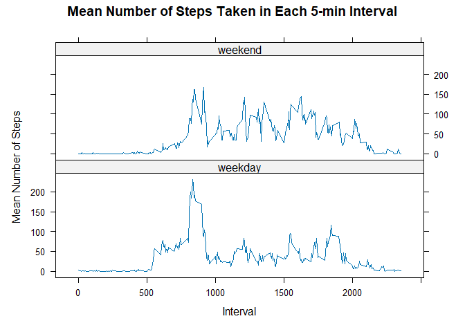

## Loading and preprocessing the data
The data `activity.csv` is loaded and preprocessed by making sure the `steps` column is the class of `integer` and turning the `date` column into `Date` class.


```r
data <- read.csv('activity.csv')
data[,"steps"] <- as.integer(data[,"steps"])
data[,"date"] <- as.Date(data[,"date"], "%Y-%m-%d")
```

## What is mean total number of steps taken per day?

The total number of steps taken per day is achieved by grouping the data by date and summing up the total steps taken. A barplot with number of steps w.r.t. each day is first generated.


```r
library(dplyr)
```

```
## 
## Attaching package: 'dplyr'
```

```
## The following objects are masked from 'package:stats':
## 
##     filter, lag
```

```
## The following objects are masked from 'package:base':
## 
##     intersect, setdiff, setequal, union
```

```r
step_summary <- 
    data %>%
    group_by(date) %>%
    summarise(total_step = sum(steps))

barplot(step_summary$total_step, names.arg = step_summary$date, main = "Total Number of Steps Taken Each Day", xlab = "Date", ylab = "Number of Steps")
```

<!-- -->

Then mean and median of the daily total step is generated by the following code.


```r
mean <- mean(unlist(step_summary[,"total_step"]), na.rm = TRUE)
median <- median(unlist(step_summary[,"total_step"]), na.rm = TRUE)
```

The mean total step is 1.0766189\times 10^{4} steps.  
The median total step is 10765 steps.

## What is the average daily activity pattern?

Now, we will examine this dataset interval-wise. The data will be grouped by interval and summarized by taking the mean number of steps in each interval across all dates. A line plot is generated to present the distribution. Finally, we use `max()` function and `which()` function to find the maximal value of all mean number of steps and retrieve its position in the list to find out the interval at which the maximum occurs.


```r
interval_summary <- 
    data %>%
    group_by(interval) %>%
    summarise(interval_avg = mean(steps, na.rm = TRUE))

with(interval_summary, plot(interval, interval_avg, type = "l", main = "Mean Number of Steps Taken in Each 5-min Interval", xlab = "Interval", ylab = "Mean Number of Steps"))
```

<!-- -->

```r
max_step <- max(unlist(interval_summary[,"interval_avg"]), na.rm = TRUE)
max_ind <- which(interval_summary[,"interval_avg"] == max_step)
max_mean <- interval_summary[max_ind,"interval"]
```

The maximum mean number of steps occurs at the interval of 835-th minute.

## Imputing missing values


```r
no_na <- sum(is.na(data[,"steps"]))
```

There are 2304 missing values in the dataset.

The missing values will be replaced by the mean number of steps of the respective interval. The value will be rounded down to get rid of the fraction. By creating a blank dataframe, the data with NAs filled-in will be concatenated to it with `rbind` function as a loop that loops through each date produces imputed dataset at the end of each iteration. Finally, a barplot is generated with the filled-in dataset.


```r
#Prepare the loop the dataset with dates
theDate <- data[1,"date"]
endDate <- data[length(data[,1]),"date"]

#Define a function that loop through the data within each day and replace NAs with the mean of the steps recorded in each 5-min interval. The values are rounded down since a fraction of a step doesn't exist.
meanstep <- function(l) {
    if (is.na(l$steps)) {
        ind <- which(interval_summary[,"interval"] == l$interval)
        l$steps <- as.integer(interval_summary[ind, "interval_avg"])
    }
    return(l)
}

df <- data.frame()

#Looping through the dataset.
while (theDate <= endDate){
    part <- data %>%
    filter(date == theDate)
    for (i in c(1:nrow(part))){
        part[i,] <- meanstep(part[i,])
    }
    df <- rbind(df, part)
    theDate <- theDate + 1
}

stepfilled_summary <- 
    df %>%
    group_by(date) %>%
    summarise(total_step = sum(steps))

barplot(stepfilled_summary$total_step, names.arg = stepfilled_summary$date, main = "Total Number of Steps Taken Each Day (Missing Values Filled)", xlab = "Date", ylab = "Number of Steps")
```

<!-- -->

```r
mean_new <- mean(unlist(stepfilled_summary[,"total_step"]), na.rm = TRUE)
median_new <- median(unlist(stepfilled_summary[,"total_step"]), na.rm = TRUE)
```

Also, the mean and median number of steps are calculated.  
The mean total step is 1.074977\times 10^{4} steps.  
The median total step is 10641 steps.  
These two values are both slightly lower than the previous ones. Although filling in the NAs with mean number of steps within the interval, the denominator over which the sum of daily total steps averages becomes bigger. That's why the resulting mean is smaller.

## Are there differences in activity patterns between weekdays and weekends?

We use `weekdays()` function to determine which day of a week each date falls in. Then, we use `case_when()` function and `factor()` function to assign the level of weekday and weekend to the data. The same procedure of retrieving the mean number of steps in each interval is conducted for each level. Finally, `xyplot()` function in the `lattice` package is used to generate the panel plot requested.


```r
library(lattice)
df_week <- df %>%
    mutate(weekday = weekdays(date))
df_week$level <- case_when(
    df_week$weekday == "Monday" | df_week$weekday == "Tuesday" | df_week$weekday == "Wednesday" | df_week$weekday == "Thursday" | df_week$weekday == "Friday" ~ "weekday",
    df_week$weekday == "Saturday" | df_week$weekday == "Sunday" ~ "weekend")
df_week$level <- factor(df_week$level)

weekday_summary <- 
    df_week %>%
    filter (level == "weekday") %>%
    group_by(interval) %>%
    summarise(interval_avg = mean(steps)) %>%
    mutate(level = "weekday")

weekend_summary <- 
    df_week %>%
    filter (level == "weekend") %>%
    group_by(interval) %>%
    summarise(interval_avg = mean(steps)) %>%
    mutate(level = "weekend")

week_summary <- rbind(weekday_summary, weekend_summary)

xyplot(interval_avg ~ interval | level, data = week_summary, type = "l", layout = c(1,2), main = "Mean Number of Steps Taken in Each 5-min Interval", xlab = "Interval", ylab = "Mean Number of Steps")
```

<!-- -->
